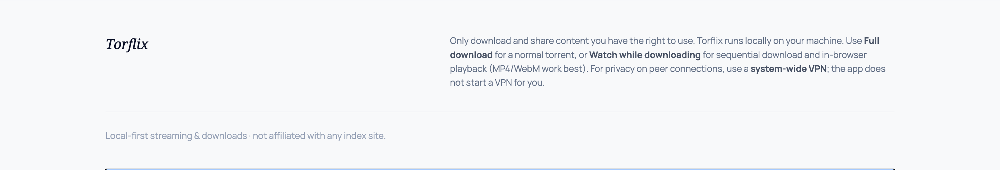
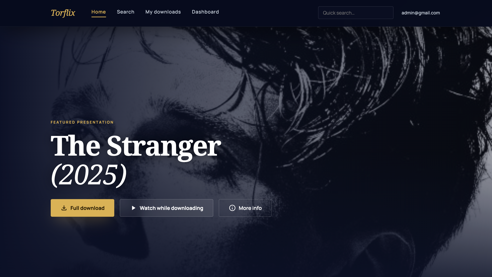
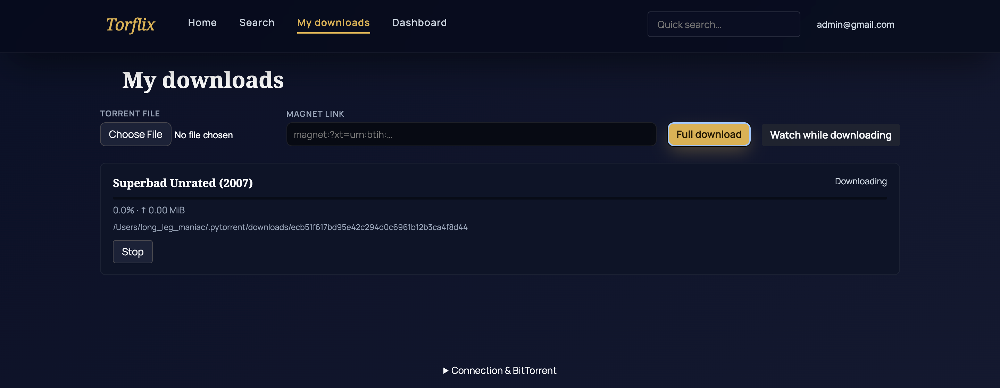
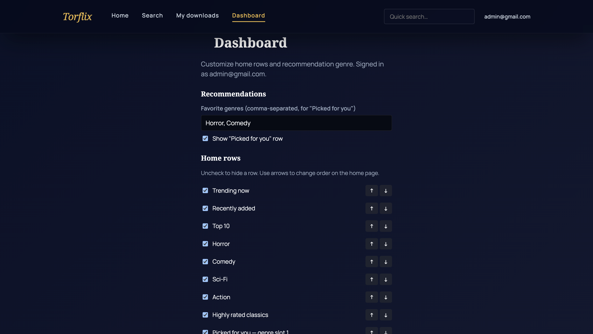

# Torflix — User guide

This guide is for anyone using the **Torflix website** on a computer where **Torflix is already installed and running**. You do not need the command line for everyday browsing, downloads, or playback.

Screenshots live in **`docs/img/`** and match the current interface. File names are numbered for maintainers; the sections below follow the order that makes sense when learning the app.

---

## 1. Important message on first visit

The first time you open Torflix, you may see a short **welcome / legal** dialog. It explains that the app runs **on your machine**, that you should only access content you are allowed to use, and where to adjust settings later.

Click **Got it** (or dismiss the dialog) to continue. You can use the rest of the app normally afterward.

---

## 2. Home — top bar and featured “entrance”

The **Home** screen opens with a large **featured** area at the top and catalog **rows** below. At the very top of the page:

- **Torflix** (logo) — go back to **Home**.
- **Home** — suggested rows (trending, genres, recommendations, and what you configured in Dashboard).
- **Search** — keyword search *(shown when catalog search is enabled)*.
- **My downloads** — torrents you added and their status.
- **Dashboard** — customize Home and optional **Sign in**.

On the right, when search is available, use **Quick search** — type at least two characters and press **Enter** to open Search with that query.

---

## 3. Recently added, Top 10, and horizontal rows

Below the hero, **Home** is organized into **horizontal rows**. Scroll sideways on a row to see more titles. Row titles depend on your catalog and **Dashboard** settings (e.g. **Recently added**, **Top 10**, site-specific trending lists).

- **Continue watching** *(if shown)* — resume in-browser playback where you left off.
- Other rows — trending, genres, “picked for you,” and similar.

Click a **poster** to open **title details** (see [§5](#5-title-details-add-to-list-and-download-options)).

---

## 4. Genre and category rows

Rows such as **Sci-Fi**, **Action**, or other **genres** group titles for browsing. Use them the same way: scroll horizontally, then open a title for details.

---

## 5. Highly rated, classics, and “picked for you”

You may see rows for **highly rated** titles, **classics**, or recommendations **based on your tastes** (when the catalog and your **Dashboard** preferences support them).

---

## 6. Title details — add, download, watch

After you click a poster, a **detail panel** opens with the title, artwork, and facts (size, seeders, quality options, etc.). From there you can:

- **Add to My List** *(heart)* — save the title in this browser; with an account, preferences can sync on this server.
- **Full download** — download the torrent in the usual piece-rare-first way (best if you want to keep the file).
- **Watch while downloading** — request **sequential** download from the start so the **Watch** page can play while data arrives. Works best for **MP4/WebM**; other formats may not play in the browser.
- **View source page** — opens the original listing in a new tab *(if the catalog provides a link)*.

**More than one torrent** (e.g. different qualities): use the **Quality / version** dropdown, pick a line, then press **Full download** or **Watch while downloading**.

Always follow the law and respect rights holders: only add content you are permitted to use.

---

## 7. Search

Choose **Search** in the top bar or use **Quick search**. Enter a keyword and browse the results grid. Selecting a result opens the same **title details** flow as on Home.

---

## 8. My downloads

Open **My downloads** to see everything you added: progress, status, and shortcuts to open the **Watch** page for jobs you started with **Watch while downloading**.

---

## 9. Watching in the browser

If you used **Watch while downloading**, playback opens on the **Watch** page. Use the normal video controls; if playback stalls, wait for more data and try **Play** again.

The app may remember **volume** on this device. Keyboard shortcuts *(see the hint on the Watch page)* typically include **Space** (play/pause), **arrow keys** (seek), **M** (mute), **F** (fullscreen).

---

## 10. Dashboard — customize Home

Open **Dashboard** to:

- Set **favorite genres** used for recommendation-style rows (comma-separated).
- Turn recommendation rows on or off.
- **Show or hide** specific Home rows and **change their order** with the up/down controls.
- **Save** — stores settings locally for guests, or on the server if you **register** and **sign in**.

Signing in is **optional**; it mainly syncs **Dashboard** preferences and **continue watching** across sessions on this Torflix server.

---

## 11. Connection and BitTorrent status

The **Connection & BitTorrent** section at the **bottom** of the page (expandable) shows whether the browser is connected to the daemon and summarizes the **BitTorrent listener**. If downloads are slow or peers are missing, the machine’s firewall, VPN, or port forwarding may need attention—whoever runs Torflix on that computer can check **[Configuration](CONFIGURATION.md)** and the health endpoint described there.

---

## 12. If something does not work

| Issue | What to try |
|--------|-------------|
| **“Catalog unavailable”** | The daemon may need the embedded catalog API or a configured search API. You can still use **My downloads** for items already added. |
| **Video does not play** | The file type may be unsupported in the browser; use **Full download** and open the file in a local player. |
| **Very slow or no peers** | Torrents depend on swarms and trackers; check firewall/VPN and the listener status at the bottom of the page. |
| **Search missing** | Catalog search may be disabled on the server; only **My downloads** and non-catalog flows may be available. |

For install steps and environment variables, see the **[README](../README.md)** and **[Configuration](CONFIGURATION.md)**.
