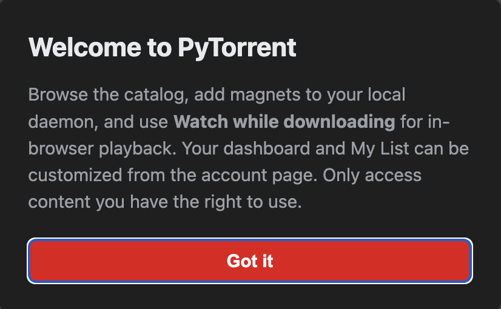
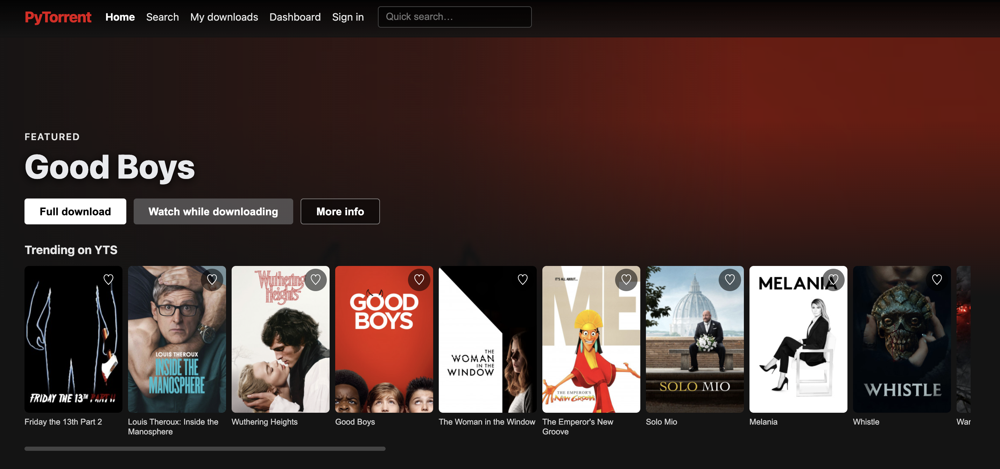
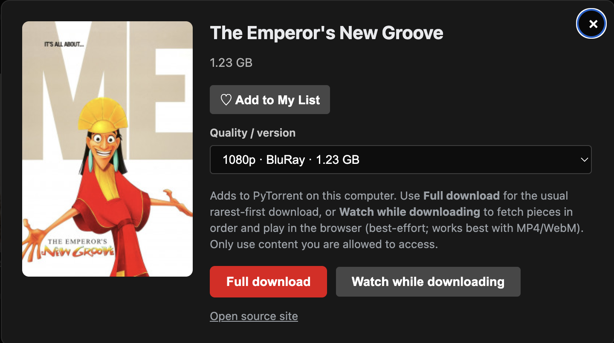
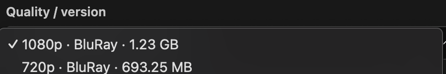

# Torflix — User guide

This guide is for anyone using the **website** after someone has already installed and started Torflix on the computer (or you are opening the app on the same machine where it runs). No command line is required for daily use.

---

## 1. First time you open the site

When you first visit, you may see a short **welcome** message. It explains that Torflix runs on your computer, that you should only use content you are allowed to access, and where to change settings later.

Click **Got it** to close the message. You can use the app normally after that.

---

## 2. Moving around the top of the page

At the top you will see:

- **Torflix** (logo) — click to go back to the **Home** screen with movie rows.
- **Home** — browse suggested rows (trending, genres, and similar).
- **Search** — look up titles by keyword (if catalog search is turned on).
- **My downloads** — list of torrents you added and their progress.
- **Dashboard** — customize what appears on Home and sign in (optional).

There is also a **quick search** box on the right (when search is available): type a few letters and press Enter to jump to Search.

---

## 3. Home screen and the movie catalog

The **Home** page shows rows of posters, similar to a streaming service. Scroll sideways on each row to see more titles. Click a poster to open **more information** about that title.

- **Continue watching** (if shown) — resume something you started in the browser player.
- Other rows — trending, recent releases, genres, and lists you configured in Dashboard.

---

## 4. Title details (one movie)

After you click a poster, a **detail panel** opens with the title, picture, and short facts (size, seeders, etc.).

From here you can:

- **Add to My List** (heart) — save the title to your personal list on this browser (and sync if you create an account and save Dashboard).
- **Full download** — download the torrent in the usual way (best for keeping the file).
- **Watch while downloading** — download pieces **from the beginning first** so the browser can try to **play while the file is still downloading**. This works best for common video types like MP4; some formats may not play in the browser.
- **View source page** — opens the original listing site in a new tab (if available).

Always follow the law and the rights of creators: only add content you are allowed to use.

---

## 5. Choosing quality or version

Some titles offer **more than one** torrent (for example different resolutions). Open the **Quality / version** dropdown and pick the line you want (it may show quality, type, size, and seed count).

Then press **Full download** or **Watch while downloading** as usual.

---

## 6. My downloads

Open **My downloads** to see everything you added. You can check progress, open the watch page for a job you started as “watch while downloading,” or manage files according to what your setup allows.

---

## 7. Watching in the browser

If you used **Watch while downloading**, the player opens on the **Watch** page. Use the normal video controls. If playback pauses, wait a moment for more data to download and press play again.

The site may remember your **volume** on this device. You can also use the keyboard: **Space** to play/pause, **arrow keys** to jump backward or forward, **M** for mute, **F** for full screen (see the hint text on the Watch page).

---

## 8. Dashboard (customize your Home)

Open **Dashboard** to:

- Set **favorite genres** used for “Picked for you” rows (comma-separated).
- Turn recommendation rows on or off.
- **Show or hide** specific home rows and **change their order** with the up/down arrows.
- **Save** — stores settings on this device for guests, or on the server if you **register** and **sign in**.

Signing in is optional; it mainly syncs preferences and **continue watching** across sessions on that Torflix server.

---

## 9. If something does not work

- **“Catalog unavailable”** — the person who runs Torflix may need to start the program with catalog search enabled or fix network settings. You can still use **My downloads** for things already added.
- **Video does not play** — the file type might not be supported in the browser; try **Full download** and open the file in a video app on the computer.
- **Very slow or no peers** — torrents depend on other people sharing; firewalls or VPNs can also affect connections. The owner of the machine can check the **Connection & BitTorrent** section at the bottom of the page for status.

For install and technical options, see the main **[README](../README.md)** and **[Configuration](CONFIGURATION.md)**.
